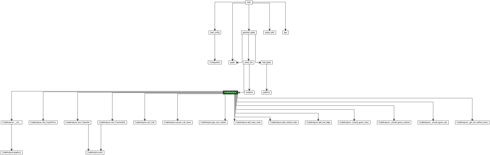

# Pyprojectviz (Python Project Visualization Tool)

<p align="center">
  
</p>

## Overview

This tool generates a Graphviz diagram of the Python project structure, showing classes, methods, and their relationships, including method calls. It's designed to help developers understand the architecture of a Python codebase by visually mapping out its components.

<p align="center">
  
</p>

- [Pyprojectviz (Python Project Visualization Tool)](#pyprojectviz-python-project-visualization-tool)
  - [Overview](#overview)
  - [Features](#features)
  - [Requirements](#requirements)
  - [Installation](#installation)
    - [Source](#source)
    - [Pip](#pip)
  - [Usage](#usage)
    - [Source](#source-1)
    - [Pip](#pip-1)
  - [Customization](#customization)
  - [License](#license)
  - [Contributions](#contributions)

## Features

- Visualizes classes and methods in a Python project.
- Shows relationships between methods, including method calls.
- Allows excluding common built-in method calls (like `join`, `split`, `append`) from the visualization.
- Supports different Graphviz layout engines for various diagram styles.
- Customizable through configuration file.

## Requirements

- Python 3.8 or higher
- Graphviz installed on your system ([Graphviz Download Page](https://graphviz.org/download/))

## Installation

### Source

1. Ensure you have Python and Graphviz installed on your system.
2. Clone the repository:

```bash
git clone https://github.com/codekuu/pyprojectviz.git
```

3. Install the Python packages `graphviz` and `typer` using Poetry:

```bash
poetry install
```

### Pip

1. Ensure you have Python and Graphviz installed on your system.
2. Install the Python package `pyprojectviz` using Pip:

```bash
pip install pyprojectviz
```

## Usage

### Source

Run the script from the command line with the following arguments:

```bash
poetry run python pyprojectviz . --config examples/example_conf_file.yaml
```

### Pip

Run the script from the command line with the following arguments:

```bash
python -m pyprojectviz . --config examples/example_conf_file.yaml
```

This will generate a Graphviz diagram of the project at the "." path, using the specified configuration file.

## Customization

Pyprojectviz can be customized through a configuration file can be found in the [examples](examples) directory.

## License

GNU General Public License (GNU GPL)

## Contributions

Contributions are welcome. Please send pull requests or open issues to discuss proposed changes.
